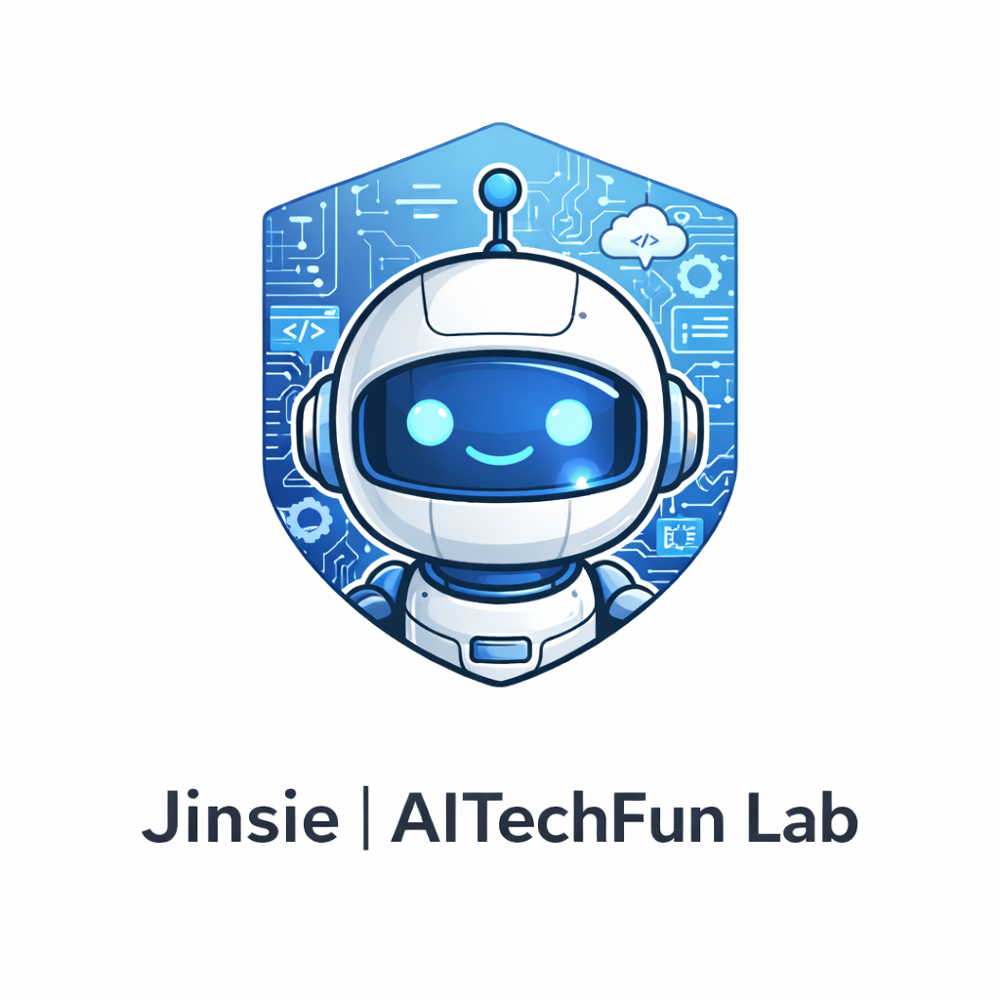

<p align="center">
  
</p>

<h1 align="center">🚀 Jinsie AI Agent Platform</h1>

<p align="center">
  Cloud-native AI Applications · RAG Systems · Multi-Agent Workflows
</p>

<p align="center">
  
  
  
  
  
</p>

---

## 📘 项目简介

**Jinsie AI Agent Platform** 是一个面向企业级场景的 **云原生 AI Agent 应用平台工程模板**，  
目标是帮助 **AI 应用工程师 / 团队** 快速构建：

- 可控、可观测的 Agent 执行流程  
- 企业级 RAG（检索增强生成）系统  
- 多 Agent / Workflow 协作应用  
- 可部署、可维护、可扩展的 AI 服务  

平台采用 **FastAPI + LangGraph + Milvus** 作为核心技术栈，强调：

- 工程化结构  
- 清晰的职责边界  
- 可演进的 Agent 能力  

---

## 🎯 适用场景

- 企业智能客服 / 内部助手  
- 知识库问答与文档检索  
- 多 Agent 自动化流程（分析 / 规划 / 执行）  
- AI 中台 / AI 应用底座  
- AI 应用工程师作品集 / 工程模板  

---

## 🔐 环境变量配置

本项目依赖以下环境变量：

- `OPENAI_API_KEY`  
- `OPENAI_MODEL`  
- `OPENAI_BASE_URL`（可选，用于 OpenAI-compatible 服务，如 SiliconFlow、通义等）  

项目中已提供示例文件 `.env.example`。

### 方式一：使用 direnv（推荐）

```bash
cp .env.example .env
direnv allow
```

进入项目目录时，环境变量会自动加载。

### 方式二：不使用 direnv（手动兜底）

```bash
cp .env.example .env
source scripts/load_env.sh
```

⚠️ 必须使用 `source` 执行脚本，确保变量加载到当前 shell。

---

## ⚡ 快速启动（5 分钟跑起来）

```bash
git clone https://github.com/jinsie-aitechfun-lab/jinsie-ai-agent-platform.git
cd jinsie-ai-agent-platform
pip install -r requirements.txt
uvicorn app.main:app --host 0.0.0.0 --port 8000 --reload
```

访问 API 文档：  
👉 http://localhost:8000/docs

---

## 🧠 架构概览

```text
Client
  |
  v
FastAPI API Layer
  |
  +-- Agent Orchestration (LangGraph)
  |     |
  |     +-- Planner / Executor / Tools
  |
  +-- RAG Pipeline
        |
        +-- Embedding -> Milvus -> Retrieval
```

---

## 🧩 核心能力

### ✅ Agent 执行层（Engineered Agent）

- 明确的输入 / 输出契约  
- 可验证的 JSON 结构化输出  
- 容错解析与调试支持  

### ✅ RAG 管道

- 文档分段与向量化  
- Milvus 向量存储与检索  
- 可替换 Embedding / Retriever  

### ✅ 工程化 API

- FastAPI 路由分层  
- Pydantic 数据模型  
- 自动 Swagger 文档  

### ✅ 云原生友好

- Docker 容器化  
- 易于部署到阿里云 / 腾讯云 / 私有云  

---

## 🖥️ CLI 使用方式与示例

本项目提供了一个 **最小但工程化的 CLI 工具**，用于在命令行中执行一次 Agent 调用。  
该工具主要用于：

- 调试与验证 Prompt 行为  
- 校验 Agent 输出是否符合严格 JSON 结构  
- 生成可复现、可提交的示例结果  

### 查看帮助信息

```bash
python -m scripts.run_agent_once -h
```

该命令会输出所有可用参数及使用说明。

### 执行一次 Agent 调用

```bash
python -m scripts.run_agent_once "生成一个严格 JSON 执行计划"
```

说明：

- 执行结果会直接输出到标准输出（stdout）  
- 输出内容必须是 **严格的 JSON 对象**  
- 在输出前会进行结构校验  

### 将输出保存为文件（推荐方式）

```bash
python -m scripts.run_agent_once "生成一个严格 JSON 执行计划" \
  --output-file docs/samples/agent_output.json
```

说明：

- 校验通过后的 JSON 结果会保存到指定路径  
- 若父目录不存在，将自动创建  
- **推荐用于生成文档示例或测试样本**  

### 使用文件作为输入（替代命令行文本）

```bash
python -m scripts.run_agent_once \
  --input-file docs/samples/agent_plan_prompt.txt \
  --output-file docs/samples/agent_output.json
```

该方式适用于：

- Prompt 内容较长  
- 需要进行版本管理的 Prompt  
- 需要多次复用的输入  

### 调试非法输出

当模型输出无法解析为合法 JSON 时：

- 程序会立即失败并给出明确错误提示  
- **完整的原始模型输出** 会被保留在本地：

```text
docs-private/_debug/last_agent_raw.txt
```

该文件仅用于本地调试，**不应提交到仓库**。

---

## 🏗️ 项目结构

```plaintext
app/
  ├── agents/          # Agent / Workflow（LangGraph）
  ├── rag/             # RAG 管道、Embedding、检索
  ├── api/             # FastAPI 路由
  ├── core/            # 配置、初始化、基础组件
  ├── services/        # 业务服务 / 工具封装
  └── models/          # Pydantic 数据模型
docs/
  ├── assets/          # Logo / 架构图 / Demo
  ├── architecture/   # 架构与工程说明
  └── samples/         # CLI / Agent 输出示例
scripts/
  ├── run_agent_once.py
  └── load_env.sh
tests/
  └── ...
```

---

## 🎬 Demo（占位）

建议提供一段 20–40 秒的演示动图，展示：

1. Agent 接收请求  
2. 执行规划 / 调用工具 / RAG  
3. 返回结构化结果  

文件路径建议：

```text
docs/assets/demo.gif
```

---

## 🤝 Contributing

欢迎以下类型的轻量贡献：

- 文档改进  
- 示例补充  
- Bug 修复（非核心逻辑）  

为保证架构一致性：

- 核心模块（`app/agents`, `app/rag`, `app/core`）由维护者统一管理  

详见 `CONTRIBUTING.md`。

---

## 📄 License

MIT License  
© 2025 Jinsie | AITechFun Lab
