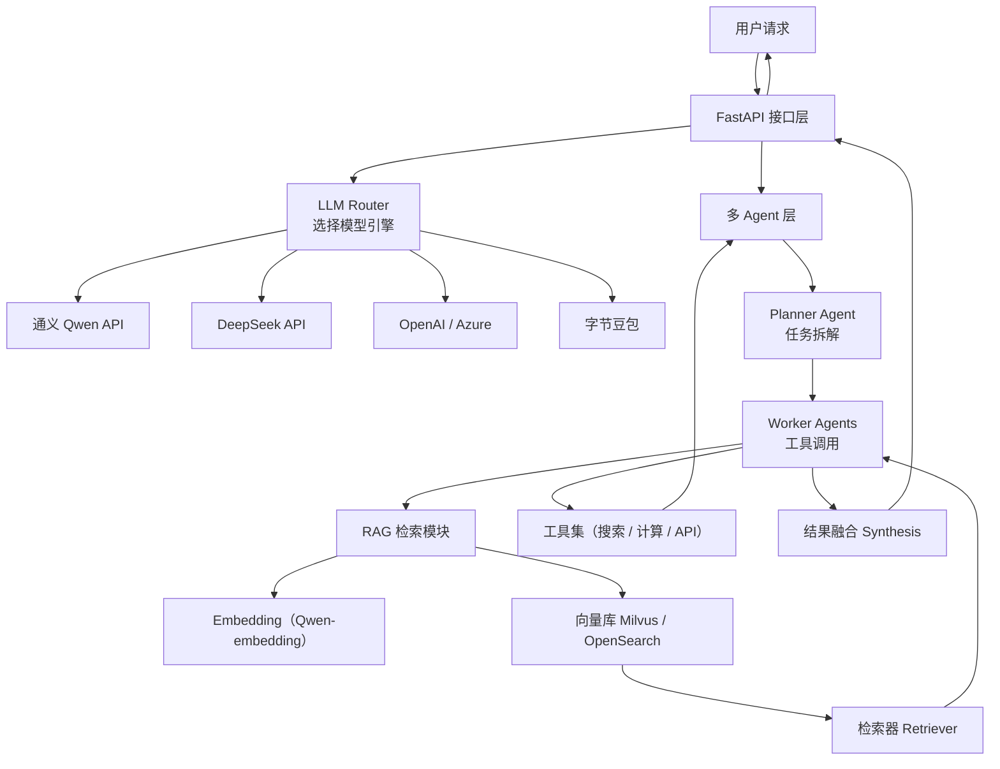

# Architecture Overview（通义千问增强版）

本文件描述项目的整体架构，包括多模型路由、通义千问增强层、RAG 检索链路、多 Agent 执行流、FastAPI 服务层与阿里云部署架构。

## 1. System Architecture Diagram

## 2. Component Breakdown

### 2.1 FastAPI 服务层  
统一 HTTP 入口、参数校验、Router/Agent/RAG 调用、SSE 流式输出。

### 2.2 多模型路由  
根据任务类型自动选择 Qwen / DeepSeek / GPT / Doubao。

## 3. RRAG Pipeline（通义增强）

Qwen-Embedding → Milvus/OpenSearch → Top-k 检索 → Agent 综合总结。

## 4. Agent Architecture  
Planner → Worker → ToolCall → RAG → Synthesizer。

## 5. SSE Streaming  
支持 token-level 流式输出，前端实时渲染。

## 6. Directory Structure  
（略，与你项目结构一致）

## 7. Deployment（阿里云）
Docker → ACR → ECS/Serverless → ALB → SLS。

## 8. 通义千问增强层总结
- Qwen API 主力  
- Qwen-Embedding  
- ToolCall-native  
- RAG 与 OpenSearch 兼容  
- SSE 兼容通义  
