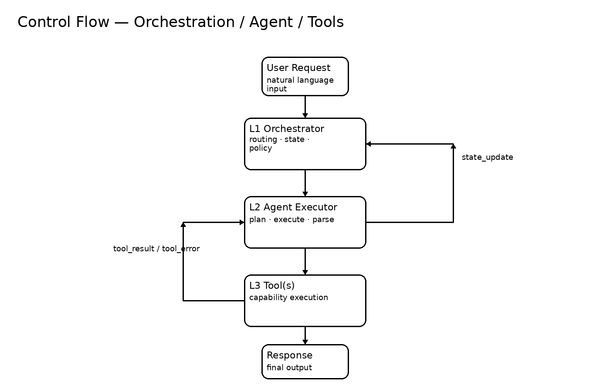
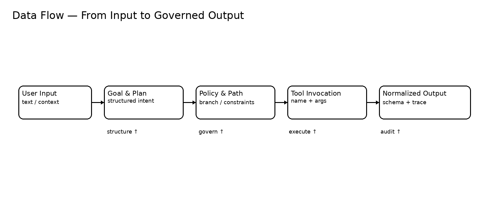
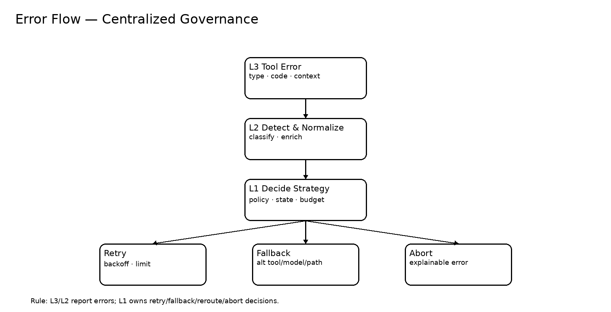

# System Architecture Abstraction

> A production-grade abstraction model for building controllable, extensible, and governable LLM-based systems.
> 
> This document focuses on **layering, boundaries, contracts, governance, and extensibility**—so the system can scale from a single agent to a platform.

---

## 1. Design Goals

- **Controllable execution**: deterministic governance over routing, state, retries, and fallbacks.
- **Extensible architecture**: plug-in tools, configurable workflows, multi-agent composition without rewrites.
- **Governable operation**: observability, auditability, safety policies, and cost controls.
- **Maintainable evolution**: strict boundaries and contracts to prevent coupling and regression.

---

## 2. Layered Model (L1 / L2 / L3)

### L1 — Orchestration Layer (Control Plane)
**Owns**:
- workflow routing (sequence / branching / reroute)
- state transitions and persistence
- retry / fallback / abort policies
- global budgets (tokens / time / tool quotas)
- global tracing and audit events

**Must not**:
- implement tool logic
- embed prompt crafting and generation details

### L2 — Agent Layer (Execution Plane)
**Owns**:
- goal understanding and task execution
- prompt/policy application from L1 constraints
- tool argument construction and tool result parsing
- local validation and normalization

**Must not**:
- encode global workflow decisions
- manage global state machines or cross-step retries

### L3 — Tool Layer (Capability Plane)
**Owns**:
- single-responsibility capability execution (API calls, database ops, parsers, etc.)
- strict input/output schemas
- deterministic side-effect declaration

**Must not**:
- contain orchestration logic (retry/fallback/reroute)
- call other tools implicitly
- store global state

---

## 3. Core Building Blocks

### Agent
A goal-driven executor that transforms user intent into structured actions, invoking tools when needed.

### Tool
A single capability provider with strict contracts: **input_schema → output_schema / error_schema**.

### Workflow
A configurable set of states, transitions, and actions. It defines the route; it does not “execute” the route.

### Glue (Adapter / Registry / Router)
Infrastructure components that connect layers:
- **Adapter**: standardize provider APIs (OpenAI/Qwen/etc.)
- **Registry**: tool discovery and validation
- **Router**: policy-based selection for workflow path or tools

---

## 4. Flows: Control / Data / Error

### 4.1 Control Flow


Key rule:
- L1 owns **decisions and governance**.
- L2 owns **execution and parsing**.
- L3 owns **capability execution**.

### 4.2 Data Flow


Recommended data lifecycle:
- natural language input → structured intent/plan → governed path/policy → tool invocation → normalized output + trace

### 4.3 Error Flow


Central governance rule:
- L3/L2 **report errors**
- L1 **decides**: retry, fallback, reroute, abort

---

## 5. Contracts (Non‑Negotiable)

### Tool Contract
Each tool must define:
- `name` (unique)
- `input_schema` (JSON Schema)
- `output_schema` (JSON Schema)
- `error_schema` (JSON Schema, typed)
- `idempotency` (true/false)
- `side_effects` (none / external_write / destructive / etc.)
- `timeout_ms` and `rate_limit` (optional but recommended)

### Event Contract (Observability)
Every run should emit:
- `trace_id`
- `span_id` per step/tool call
- `state_transition` events (from → to)
- `tool_call` events (name, args_hash, latency_ms, outcome)
- `error` events (type, code, context)

---

## 6. Governance: Retry / Fallback / Reroute

### Retry (L1)
Use only for transient failures. Must include:
- max attempts
- exponential backoff
- jitter (optional)
- circuit breaker (recommended)

### Fallback (L1)
Switch to alternative:
- tool
- model/provider
- workflow path

### Reroute (L1)
Change the workflow branch based on:
- evidence quality
- safety checks
- cost/time budgets
- error categories

### Abort (L1)
Return explainable, safe, and actionable error messages.

---

## 7. Extensibility Patterns

### 7.1 Multi-Agent Composition
Recommended composition patterns:
- **Planner → Executor → Critic**
- **Retriever → Synthesizer → Verifier**
- **Controller Agent** supervised by L1 policies

Rule:
- Agents do not “chat” directly in a coupled way.
- Coordination happens via L1 message/state contracts.

### 7.2 Plug-in Tools
Goal:
- add a tool by registering it (no changes to core agent code)

Mechanisms:
- tool registry with schema validation
- permission gating per agent/workflow
- sandboxing for side-effect tools

### 7.3 Configurable Workflows
Workflow should be:
- declarative (YAML/JSON)
- state-machine friendly
- replayable and auditable

---

## 8. Minimal Reference Structure

```
app/
  l1_orchestrator/
    router.py
    state_machine.py
    policy.py
    events.py
  l2_agents/
    base_agent.py
    executor.py
    parser.py
    planners/
    critics/
  l3_tools/
    tool_registry.py
    builtin/
    integrations/
  glue/
    providers/
    adapters/
docs/
  architecture/
    system_architecture_abstraction.md
    system_control_flow.png
    system_data_flow.png
    system_error_flow.png
```

---

## 9. Quality Gates (Recommended)

- contract tests for tool schemas and error types
- replay tests for workflows (same input → same trace shape)
- policy tests for retry/fallback/reroute
- observability checks (trace completeness)
- cost budget checks (token/time limits)

---

## 10. Summary

This architecture is designed as a **platform foundation**, emphasizing:
- strict boundaries (L1/L2/L3)
- contract-first components (tools, events)
- centralized governance (errors, budgets, state)
- extensibility (multi-agent, plug-ins, workflows)
- operational readiness (observability, audit)

